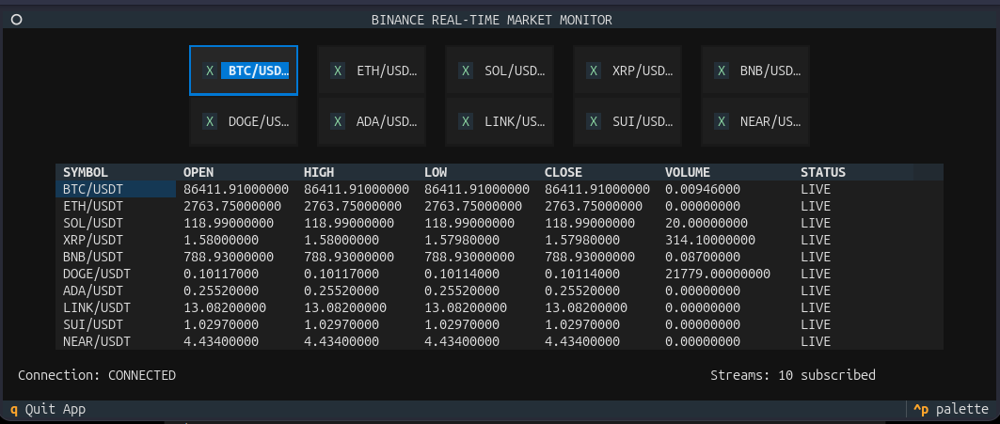

# Binance WebSocket Client

A real-time cryptocurrency market monitor built with Python, `asyncio`, WebSockets, and Textual.

The application connects directly to the Binance WebSocket API, subscribes to native 1-second candlestick streams, and displays live OHLCV market data in a terminal user interface.



## Overview

This project was built to practice real-time data ingestion using WebSockets and asynchronous Python.

It maintains a persistent WebSocket connection to Binance and allows users to dynamically subscribe and unsubscribe from cryptocurrency streams through a Textual terminal interface.

The application monitors ten cryptocurrency pairs and displays the latest Binance 1-second OHLCV candlestick data for each selected market.

## Features

- Real-time Binance WebSocket market data
- Native Binance 1-second candlestick (`kline_1s`) streams
- Live OHLCV data:
  - Open
  - High
  - Low
  - Close
  - Volume
- Ten cryptocurrency markets
- Dynamic stream subscription and unsubscription
- Textual terminal user interface
- Asynchronous WebSocket communication with `asyncio`
- Automatic WebSocket reconnection
- Exponential reconnection delay
- Automatic subscription restoration after reconnecting
- WebSocket ping/pong heartbeat configuration
- Live connection status
- Live subscription count
- Application logging

## Monitored Markets

The application currently supports:

- BTC/USDT
- ETH/USDT
- SOL/USDT
- XRP/USDT
- BNB/USDT
- DOGE/USDT
- ADA/USDT
- LINK/USDT
- SUI/USDT
- NEAR/USDT

Each market can be subscribed to or unsubscribed from independently using the checkboxes in the interface.

## Architecture

```text
Binance WebSocket API
        │
        │  @kline_1s
        ▼
BinanceWebSocketClient
        │
        │  JSON messages
        ▼
      Parser
        │
        │  Normalized OHLCV
        ▼
   Textual Application
        │
        ▼
 Live Market DataTable
```

The project separates the WebSocket connection, message parsing, configuration, logging, and user interface into individual components.

## Project Structure

```text
binance-websocket-client/
├── assets/
│   └── binance-market-monitor.png
├── src/
│   ├── __init__.py
│   ├── client.py
│   ├── config.py
│   ├── logger.py
│   └── parser.py
├── .gitignore
├── binance_css.tcss
├── main.py
├── README.md
└── requirements.txt
```

### `main.py`

Application entry point and Textual user interface.

It manages:

- Symbol selection
- Market table updates
- Connection status
- Subscription count
- Interaction between the GUI and WebSocket client

### `src/client.py`

Contains the asynchronous Binance WebSocket client.

It is responsible for:

- Establishing the WebSocket connection
- Receiving messages
- Subscribing to streams
- Unsubscribing from streams
- Maintaining subscription state
- Detecting connection loss
- Reconnecting automatically
- Restoring subscriptions after reconnecting

### `src/parser.py`

Parses Binance kline messages and extracts the OHLCV data required by the application.

### `src/config.py`

Contains WebSocket configuration including:

- Binance WebSocket URI
- Retry delay
- Maximum retry delay
- Ping interval
- Ping timeout
- Log file location

### `src/logger.py`

Configures application logging.

### `binance_css.tcss`

Contains the Textual CSS used to style the terminal interface.

## WebSocket Streams

The application uses Binance native 1-second kline streams.

A stream follows the format:

```text
<symbol>@kline_1s
```

For example:

```text
btcusdt@kline_1s
ethusdt@kline_1s
solusdt@kline_1s
```

The received kline data is parsed into:

```text
SYMBOL
OPEN
HIGH
LOW
CLOSE
VOLUME
```

The latest values are then written to the corresponding row in the Textual `DataTable`.

## Dynamic Subscriptions

Checkboxes in the interface directly control Binance WebSocket subscriptions.

When a market is selected:

```text
Checkbox enabled
      ↓
SUBSCRIBE request
      ↓
Binance WebSocket
      ↓
Market data displayed
```

When a market is deselected:

```text
Checkbox disabled
      ↓
UNSUBSCRIBE request
      ↓
Binance WebSocket
      ↓
Market removed from table
```

The client maintains its own subscription state so the desired streams remain known even if the WebSocket connection is temporarily unavailable.

## Reconnection

The WebSocket client automatically attempts to reconnect when the Binance connection is lost.

The retry delay increases exponentially until reaching the configured maximum delay.

```text
Connection lost
      ↓
Wait
      ↓
Reconnect
      ↓
Restore subscriptions
      ↓
Resume market data
```

Subscription state is maintained independently from the active WebSocket connection. This allows the application to restore the selected streams automatically after reconnecting.

## Requirements

- Python 3
- `websockets==16.0`
- `textual==8.2.8`

Install the required packages with:

```bash
python -m pip install -r requirements.txt
```

## Installation

Clone the repository:

```bash
git clone https://github.com/mahmoud8999/binance-websocket-client.git
cd binance-websocket-client
```

Create a virtual environment:

```bash
python -m venv .venv
```

Activate it on Linux/macOS:

```bash
source .venv/bin/activate
```

Install the dependencies:

```bash
python -m pip install -r requirements.txt
```

## Usage

Start the application with:

```bash
python main.py
```

All ten markets are selected by default.

Use the checkboxes to subscribe or unsubscribe from individual cryptocurrency markets.

Press:

```text
q
```

to exit the application.

## Technologies

- Python
- asyncio
- WebSockets
- Textual
- Binance WebSocket API 
